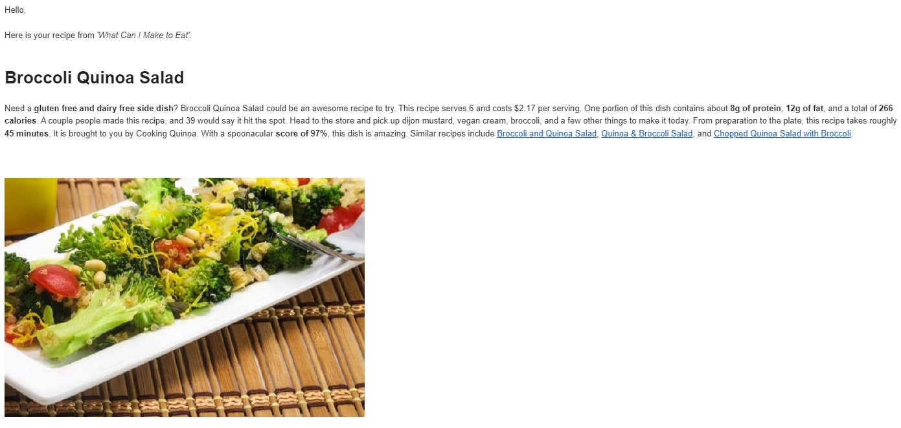

# What Can I Make to Eat?

## Table of Contents

[Description](#description) | [Features](#features) | [Technology](#technology) | [Screenshot](#screenshot) | [Project Team](#project-team) | [Questions](#questions) | [License](#license)

## Description
People are often looking for ideas of what to make to eat. Users can log into this application and provide a list of ingredients they have on hand to receive recipe suggestions based on those ingredients. They can view full recipe details and choose to have recipes they like emailed to them. In addition, users can sign up to receive a daily email that contains one recipe that matches preferences they provide.

## Features
- User can sign-up, log-in and log-out of the service
- User can request recipe suggestions based on ingredients on hand
- User is able to view a particular recipe in the browser and request that it is emailed to them
- User can sign-up for a daily recipe based on their preferences that will be sent by email
- Jenkins pipeline automates the testing, building and deployment of the project
- Google Kubernetes Engine (GKE) cluster used with pods and services
- Docker Hub used to store and distribute container images and for deployment
- Manifest files used to establish deployment objects and load balancing services
- Unit tests created using JUnit & Mockito with over 70% coverage
- Persisted data through a Google Cloud Platform MySQL database

## Technology
Key technologies and dependencies used in this project:
- IDE(Java/SQL)
- Java 8
- JUnit
- Spring Test
- Spring Boot
- MySQL
- Docker
- Kubernetes/GKE
- Grafana
- Prometheus
- Helm
- Jenkins
- Java / Spring Mail
- Spoonacular API (Recipe - Food - Nutrition)

## Screenshot
#### Recipe Email

## Project Team
- Aneesh Chulliparambil Mohanan
- Anju Naduthuruthel Kumaran
- Daryl Nauman
- Nusrat Rahman

## Questions
Please contact a group member if you have any questions.

## License
This product is under the MIT License.
